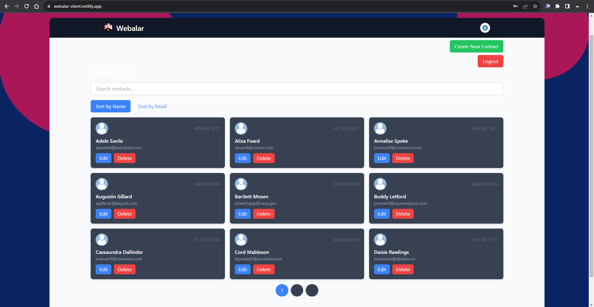

# Contact Management React Frontend

This repository contains the React frontend for the Contact Management application.

## Demo

Check out the live demo of the Webalar App: [Demo Link](https://webalar-client.netlify.app) 
Demo User, 
Email : user@test.com 
Password : 123456 

## Getting Started

1. Clone this repository to your local machine.
2. Install dependencies using `npm install`.
3. Configure environment variables using `.env.local` (copy from `.env.example`).
4. Run the development server using `npm start`.

## Features

- Display a list of contacts fetched from the backend.
- View, edit, and delete individual contacts.
- Create new contacts.
- User Authentication

## Technologies Used

- React
- React Router
- Axios
- Tailwind CSS (or your preferred CSS framework)

## Contributing

Contributions are welcome! Please open an issue or submit a pull request for any improvements or bug fixes.

## Deployment

The app is deployed on [Render](https://webalar-client.onrender.com). Check out the deployment section for more details.

## License

This project is licensed under the [MIT License](LICENSE).
